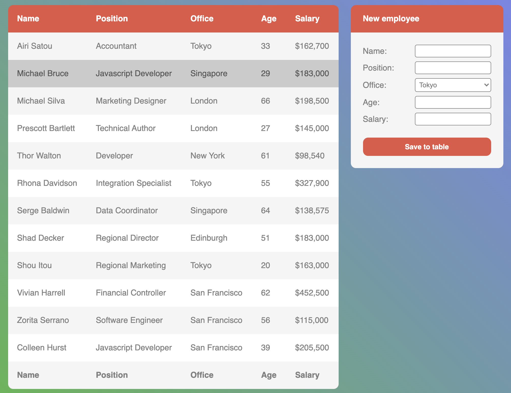

# Employees table

- [DEMO LINK](https://mykhailoshchuka.github.io/js_employees_table_DOM/)

## Used technologies:
- JavaScript (ES6)
- SCSS
- HTML5
- CSS3

## Here's a summary of the implemented functionalities and their solutions:

- Table sorting by clicking on the title (in two directions) has been implemented. When users click on one of the table headers, the table is sorted in ASC order, and the second click sorts it in DESC order. When users click on a new title, it always sorts in ASC order.

- When a user clicks on a row, it becomes selected. Only one line can be selected at a time.

- A script to add a form to the document has been written. The form allows users to add new employees to the spreadsheet. Clicking on 'Save to table' adds a new employee to the table.

- Notifications are shown if form data is invalid. Clicking on 'Save to table' runs validation for form inputs. If data is valid, a new employee is added to the table. Error notifications are displayed if the 'Name' value has less than 4 letters or the 'Age' value is less than 18 or more than 90. A success notification is displayed if a new employee is successfully added to the table.

- Editing of table cells by double-clicking on them has been implemented. Double-clicking on a cell of the table removes text and appends an input with the cell-input class. Only one cell can be edited at a time. On blur or 'Enter' keypress, changes are saved to the table cell, the input is removed, and the new text is set in the table cell. If an input is empty on submitting, the initial value is returned.

## Result of your code:

